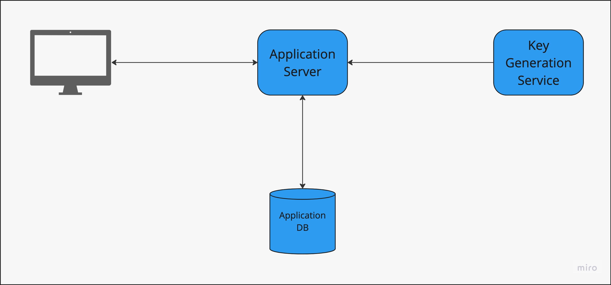

# URL shortening service

### Functional Requirements : 
1. Given a URL, generate a Short URL
2. When a user accesses a short URL, redirect to the original URL

### Non Functional Requirements :
1. The system should be highly available. If the system is not available, the system redirects would start failing.
2. URL redirection should happen with low latency
3. System should protect against the URLs being guessed.

### Extended Requirements:
1. System should be accessible by REST APIs 
2. Analytics

## Overview</H2>
### Base Diagram

### Transition 1- Using Offline Key Generation

### Transition 2 - Using Load Balancer

### Transition 3 - Using Cache & Sharded Key DB

### Transition 4 - Using Zookeeper

## Capacity Estimations

### Assumptions
1. The system is read heavy, there are more reads than writes
2. Let's assume a 100:1 read-write ratio

### Traffic Estimates 
1. 100 URL writes per second = 250 Million Writes per month = 3 Billion URLs per year.
2. 100 * 100 Reads per second = 10k reads per second = 2.5 Billion Reads Mer Month = 30 Billion Reads per year

### Storage Estimates 
1. Assuming on an average a new URL is stored for 5 years
2. Let's assume the average size of a write URL is 1000 bytes(1KB)
3. Total objects to be stored in 5 years = 3 billion * 5 = 15 billion URLs
4. Total storage required = 15 billion * 1 KB = 15 TB

### Bandwidth estimates 
1. Write : (100 URLs * 1 KB)/second = 100 KBPS
2. Read : 100 * 100 KBPS = 10 MBPS

### Cache estimates 
1. Following the 80:20 Rule, assuming 20% of the URLs are hot, and they generate 80% of traffic.
2. Read requests per day : 10 K * 60 * 60 * 24 = 864,000,000 = 864 million/day
3. Cache = 0.2 * 864 million * 1 KB = 170 GBs

### How long should the short URL be 
1. What is the scale of the application
    15 billion URLs created in an year.
2. What characters can be used
    Its safe to use the characters A-Z, a-z, 0-9 for creating the URL
3. What should be the length of short URL based on size and allowed characters :
    The number of characters being considered are 62(A-Z, a-z, 0-9)
   * 62 ^ 1 = 62
   * 62 ^ 2 = 3844
   * 62 ^ 3 = 238328
   * 62 ^ 4 = 14,776,336        ~ 14.7 million
   * 62 ^ 5 = 916,132,832       ~ 916 million (cannot cover for even an year)
   * 62 ^ 6 = 56,800,235,584    ~ 56 billion  (can cover for approx 3 years)
   * 62 ^ 7 = 3,521,614,606,208 ~ 3.5 trillion (this size looks good enough for a substanitial amount of time)
    
   The size of the short URL created should be 7 characters.
4. To avoid guessing of the URLs created, we can add an extra random prefix OR suffix of say 3 characters.

<H2>Keys Generation </H2>
### Runtime/Online key generation 
#### Approach 
We can opt for random key generation.
#### Drawback 
But the drawback of this approach would be every time a new key is generated, we'll have to verify in the DB, if the key is already used until we find an unused key.

### Generating keys Offline(Using Key DB) 
#### Approach 
Here, we can generate the keys and store them in a key DB, and when a request for a key is received, its fetched from the DB.
#### Drawback 
Concurrency issue - where, if there are multiple instances of the service trying to read the same key.
#### Workaround 
   1. The Key Generation Service is sharded, and every KGS server only serves one application server.
   2. The KGS keeps a range of keys in memory/cache and those keys are marked in the DB. 

### Generating keys Offline(Using Zookeeper) 
Zookeeper works as a centralised service for maintaining configuration and provides distributed synchronisation.
#### Approach 
We'll use a range technique, where each application server will reach out to the zookeeper, and zookeeper will provide a range of values to the application server.
 For example, the ranges defined are :
* 0             -         1 million
* 1 million     -         2 million
* 2 million     -         3 million
* 3 million     -         4 million
* 4 million     -         5 million

Here, if a server consumes all of its range, it will again bo back to the Zookeeper and get the next range.
#### Drawback 
If an application server crashes after a range has been allocated to it, that range would be wasted. However, since we have more than 3 trillion ranges, 1 million wasted here and there won't be significant.

## Summary : 
1. New URLs : 100 URLs per second : 250 million new URL per month
2. URL Redirections : 10 k Reads per second : 2.5 billion URL redirects
3. Incoming data : 100 URLs per second * 1 KB :  100 KBPS
4. Outgoing Data : 10k URLS per second * 1 KB : 10 MBPS
5. Storage for 5 years : 15 billion * 1 KB : 15 TB
6. Memory for cache : 10K URLS * 3600 * 24 * 1 KB * 20 % : 170 GB

